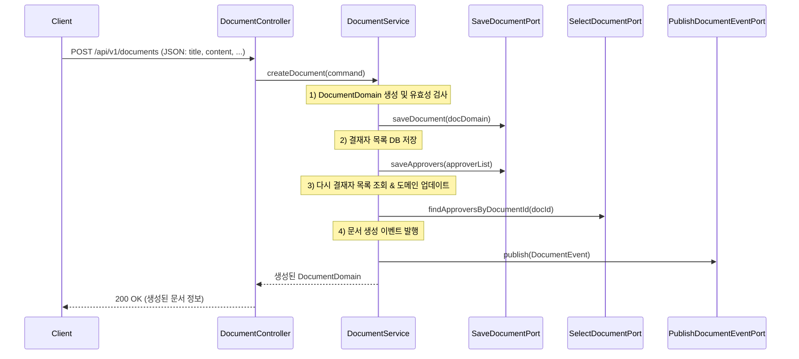
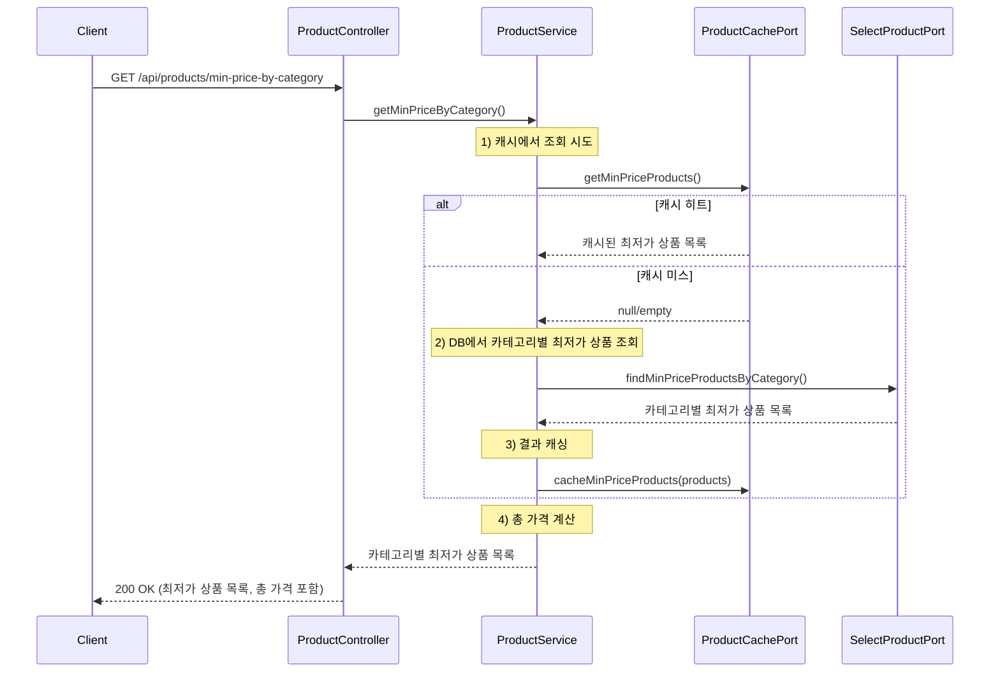
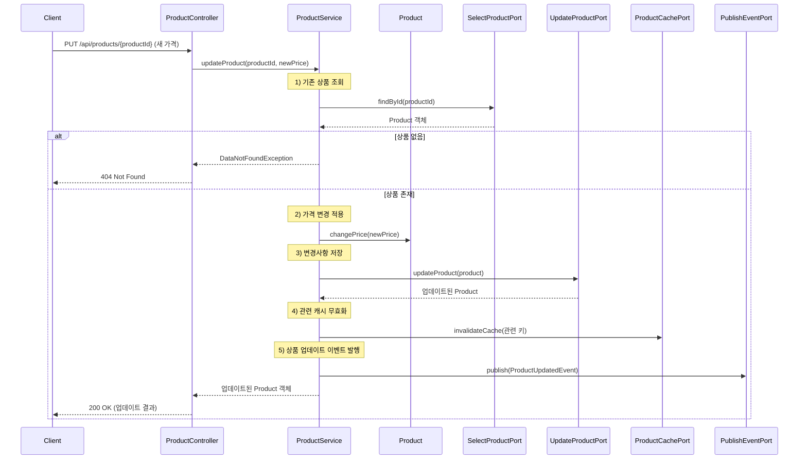
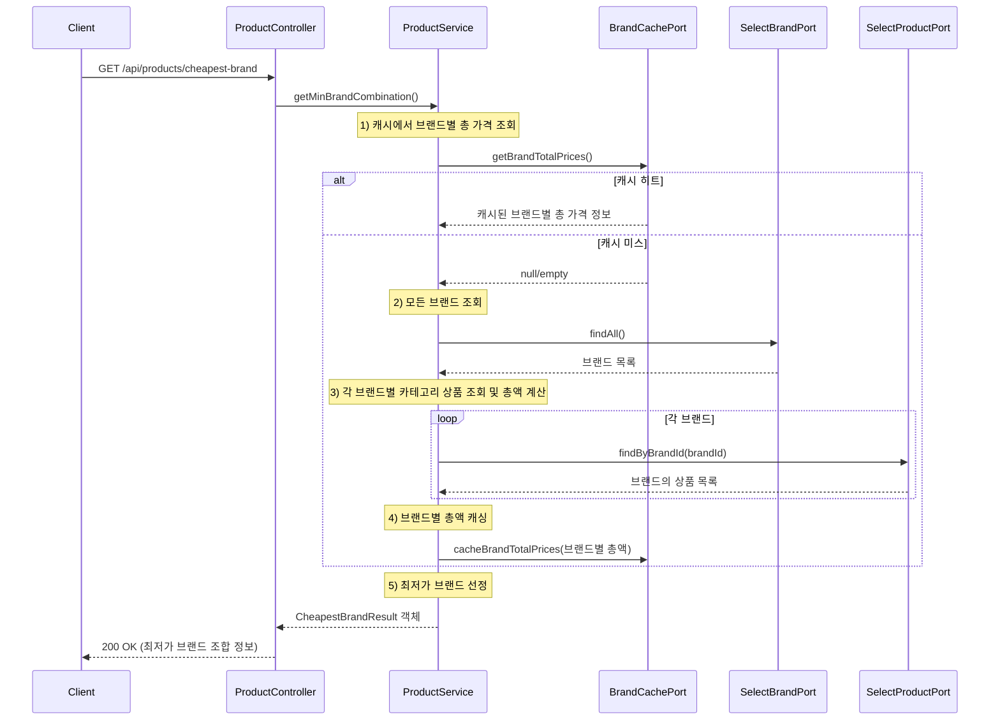
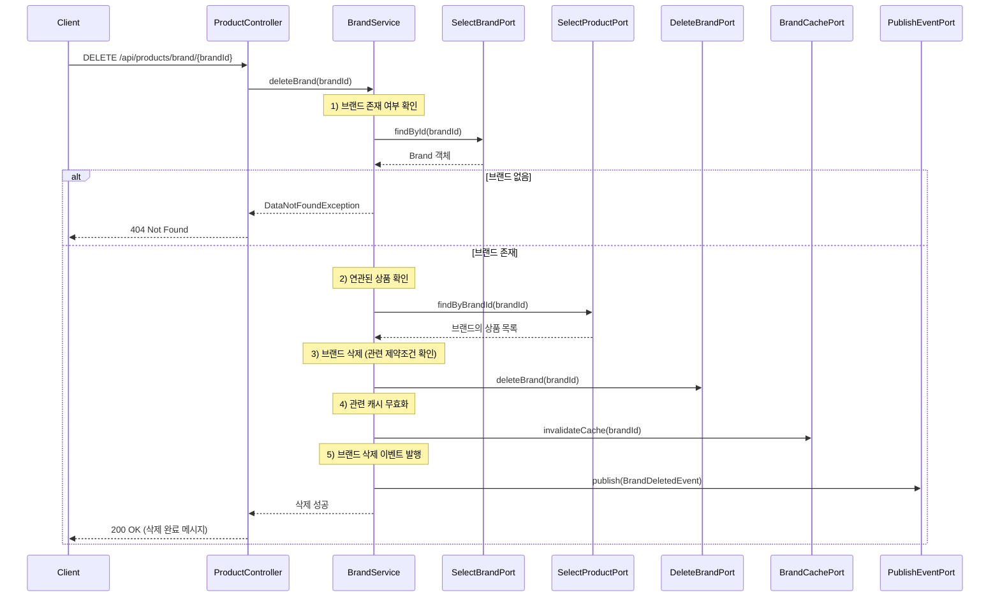
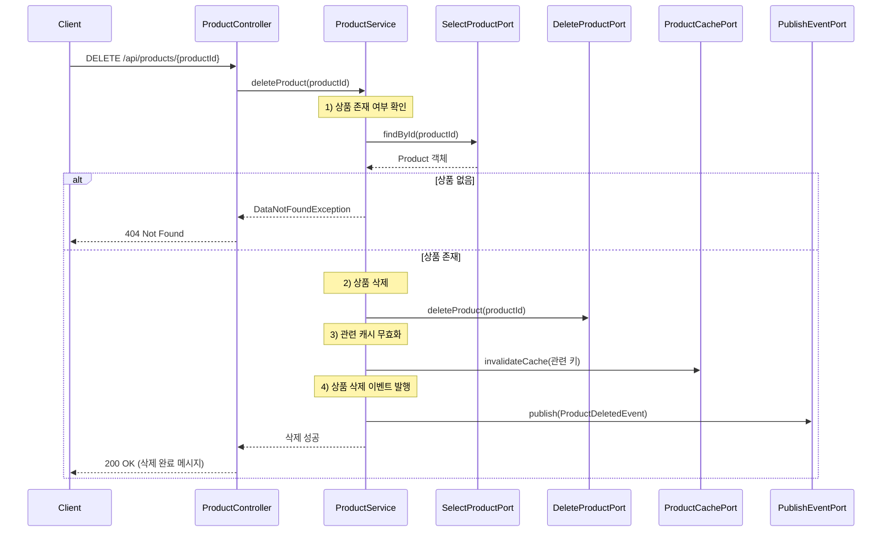
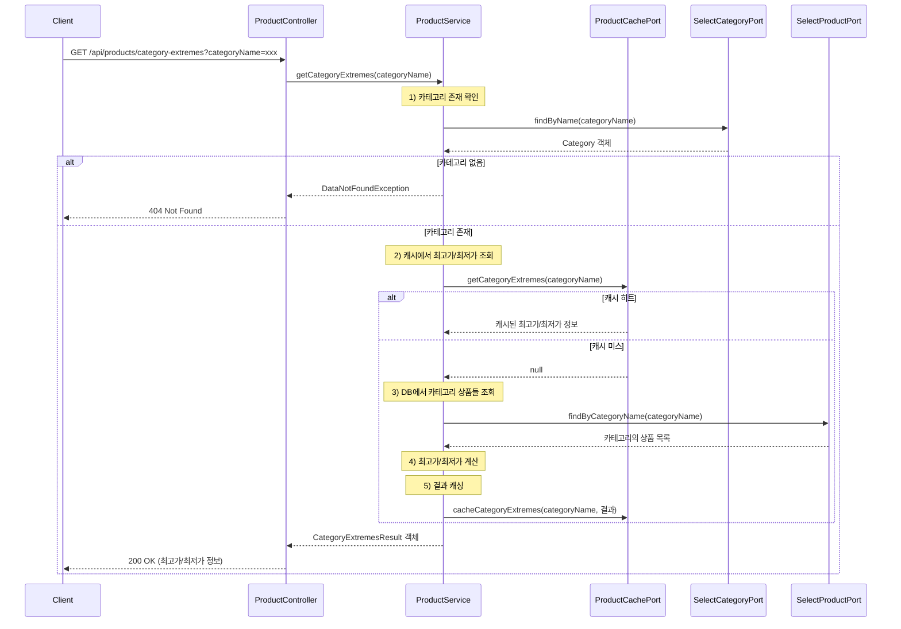

# 쇼핑 시스템 (Shopping System)

## 구현 범위에 대한 설명

### 프로젝트 개요

이 프로젝트는 헥사고널 아키텍처 기반의 쇼핑 시스템을 구현한 애플리케이션입니다. 주요 기능으로 브랜드, 카테고리, 상품 관리 및 가격 분석 기능을 제공합니다.

### 아키텍처

* **헥사고널 아키텍처(육각형 아키텍처)** 패턴을 적용하여 도메인 로직과 외부 시스템과의 결합도를 낮추고 테스트 용이성을 높였습니다.
* 각 레이어는 다음과 같이 구성되어 있습니다:

  * **Domain**: 핵심 비즈니스 로직과 도메인 모델 (Brand, Product, Category)
  * **Application**: 유스케이스 구현과 포트 정의
  * **Adapter**: 외부 시스템과의 인터페이스 (REST API, 영속성, 캐시)

### 주요 기능

1. **상품 관리**
   * 상품 등록, 수정, 삭제 기능
   * 브랜드별, 카테고리별 상품 조회
2. **가격 분석 기능**
   * 카테고리별 최저가 상품 조회
   * 브랜드별 최저 가격 조합 분석
   * 카테고리별 가격 극단값(최대/최소) 분석
3. **성능 최적화**
   * 캐싱 메커니즘을 통한 조회 성능 향상 (Caffeine 캐시 적용)
   * 비동기 이벤트 처리를 통한 시스템 응답성 개선
4. **장애 대응**
   * Spring Retry를 활용한 재시도 메커니즘 구현
   * 예외 처리와 글로벌 예외 핸들러를 통한 일관된 오류 응답

## 코드 빌드, 테스트, 실행 방법

### 사전 요구사항

* JDK 21 이상
* Gradle 8.x 이상

### 빌드 방법

프로젝트 루트 디렉토리에서 다음 명령어를 실행합니다:

\# 윈도우 환경

`./gradlew.bat build`

\# 유닉스 계열 환경 (Linux, macOS)

`./gradlew build`

### 테스트 실행 방법

전체 테스트 실행:

`./gradlew test`

특정 테스트 클래스만 실행:

`./gradlew test --tests "com.ksh.shopping_system.domain.ProductTest"`

### 애플리케이션 실행 방법

`./gradlew bootRun`

또는 빌드 후 생성된 JAR 파일을 직접 실행:

`java -jar build/libs/shopping-0.0.1-SNAPSHOT.jar`

### API 엔드포인트

애플리케이션이 실행되면 다음 API 엔드포인트를 통해 기능을 사용할 수 있습니다:

1. **상품 관련 API**
   * 상품 등록: POST /api/products
   * 상품 수정: PUT /api/products/{productId}
   * 상품 삭제: DELETE /api/products/{productId}
2. **가격 분석 API**
   * 카테고리별 최저가 조회: GET /api/products/min-price
   * 브랜드별 최저 가격 조합: GET /api/products/min-brand-combination
   * 카테고리별 가격 극단값: GET /api/products/category-extremes

### 데이터베이스

이 애플리케이션은 H2 인메모리 데이터베이스를 사용합니다. 애플리케이션 실행 시 자동으로 설정되며, 기본 데이터는 `DataInitializer` 클래스에 의해 초기화됩니다.

## 기술 스택

* **언어**: Java 21
* **프레임워크**: Spring Boot 3.4.4
* **영속성**: Spring Data JPA
* **데이터베이스**: H2 (인메모리)
* **캐싱**: Caffeine
* **재시도 매커니즘**: Spring Retry
* **빌드 도구**: Gradle 8.13

## 아키텍처 특징

* **헥사고널 아키텍처**: 도메인 중심 설계로 핵심 비즈니스 로직을 외부 의존성으로부터 분리
* **이벤트 기반 통신**: 비동기 이벤트 처리를 통한 시스템 결합도 감소

이 프로젝트는 확장성과 유지보수성을 고려한 구조로 설계되어 있으며, 새로운 기능이나 외부 시스템 연동 시에도 핵심 도메인 로직에 영향을 최소화하는 방식으로 개발할 수 있습니다.

## 고민 했던 지점

### 동일 가격 시 알파벳 순 선택
    
- **핵심 고민**:
    - 여러 브랜드가 **동일 가격**(최저가/최고가/총합)을 가질 때, 어떻게 우선순위를 정할까?
            
     - 하나만 보여줄지, 여러 개를 모두 보여줄지?
            
- **해결 방향**:
        
    - 현재는 **“동일 가격이면 알파벳 순으로 앞서는 브랜드”**만 반환한다는 정책.
            
    - 구체적으로,
        - **단일 브랜드 최저 가격**(총합) API: 여러 브랜드 동률 → **알파벳 사전순 첫 브랜드**를 선택
        - **카테고리별 최저/최고가**도 **동일 가격**일 때 **알파벳 순**이 앞선 브랜드만 캐시에 저장/노출
                
    - **장점**:
        - 구현 간단, 한 브랜드만 노출 시 혼동 줄임
                
    - **확장 가능성**:
        - “동일 가격 브랜드 **모두** 표시” 요구 시, 반환 구조(복수 list)로 바꾸고, 로직 수정 필요

### 헥사고널 아키텍처 & 포트/어댑터 패턴

- **핵심 고민**: **도메인 로직**을 **외부 인프라(DB, 캐시, REST)**로부터 얼마나 **분리**할까?
    
- **해결 방향**:
    
    - **헥사고널(포트&어댑터)** 구조를 적용하여 **유스케이스**(Application Layer)와 **영속성/캐시/이벤트**(Adapter Layer)를 명확히 분리.
        
    - **Domain** 내 **Brand**, **Category**, **Product**가 **핵심 비즈니스 규칙**을 가지도록 설계.
        

### 성능 최적화 & 캐싱

- **핵심 고민**:
    
    - **카테고리별 최저가**, **브랜드별 총합**을 DB에서 매번 GROUP BY 하면 부담이 클 수 있음.
        
    - “**캐시 갱신**”은 언제, 어떻게 반영할까?
        
- **해결 방향**:
    
    - **Caffeine 캐시** 사용: 카테고리별 최저가 / 브랜드별 총합을 캐시에 저장하여 조회 성능 개선.
        
    - **상품 변경 시**(Create/Update/Delete) → **캐시 즉시 무효화/갱신**
        
    - 추가적으로, DB와 캐시 정합성을 위해 **이벤트**(Event Listener)나 **트랜잭션 커밋 후 로직** 고려.
        

### 비동기 이벤트 & 재시도 (Spring Retry)

- **핵심 고민**:
    
    - 상품 변화가 자주 일어날 때 **캐시**에 바로 반영하면 동기적으로 지연이 생길 수 있음.
        
    - 추후 분산시스템 전환 시 **일시적 캐시 연결 장애**(네트워크, Redis 다운 등) 시 어떻게 회복할까?
        
- **해결 방향**:
    
    - **`@TransactionalEventListener`** + **`@Async`**로 **이벤트**(ProductCreatedEvent 등)를 받아 **캐시 갱신** → 응답 속도 보장.
        
    - **`@Retryable`**로 **CacheConnectionException** 발생 시 **자동 재시도**(예: 최대 3번).
        
    - **재시도 예외 범위**는 일시적 장애만 한정 (`CacheConnectionException`), 비즈니스 예외는 즉시 실패.
        

### 예외 처리와 테스트 전략

- **핵심 고민**:
    
    1. **데이터 무결성**(예: 중복 브랜드, 음수 가격)
    2. **DB에 없는 브랜드/카테고리**로 상품 생성 시
    3. **트랜잭션 롤백 시 캐시가 이미 갱신되면 어떻게?**
        
- **해결 방향**:
    
    1. 서비스 로직에서 **InvalidValueException**, **DataNotFoundException** 등 명확히 던져 글로벌 핸들러에서 처리.
    2. **도메인 단위 테스트**를 **다양한 시나리오**(중복 브랜드, 없는 상품, 음수 가격 등)로 작성해 **오류** 방지.
    3. **통합 테스트**를 **다양한 시나리오**(실제 과제 데이터를 활용한 응답 및 그외 다양한 테스트케이스)를 작성하여, 에러 방지.
    3. **@TransactionalEventListener(phase=AFTER_COMMIT)**로 **롤백되면 이벤트 발생 X** → 캐시 오염 방지.
        

### 다양한 테스트 케이스

- **도메인 테스트**: Brand, Category, Product 객체 검증(이름이 비거나 음수 가격 시 에러 등).
    
- **서비스 단위 테스트**: **Mock**으로 **Repository/Port**를 대체해 “상품 변경 시 캐시 갱신 로직” 검증.
    
- **통합 테스트**:
    
    - **H2 DB** + **Spring Context**로 실제 DB 연동
        
    - **부분적으로 캐시나 외부 호출**을 Mocking(혹은 실 캐시)
        
    - **다중 브랜드/카테고리** 등록 시 **합계/최저/최고** 정확성,
        
    - **재시도(@Retryable)** + **비동기(@Async)**가 실제로 동작하는 흐름.
        

### **결론**
    1. **도메인 로직**을 확실히 분리해 유지보수와 테스트 편의성 확보
        
    2. **캐시**(Caffeine)와 **DB** 간 **정합성** & **성능**을 어떻게 만족할까 → 이벤트 & 재시도 로직 도입
        
    3. **예외 처리**를 통한 사용자 피드백 & 시스템 안정성 (DataNotFoundException, InvalidValueException 등)
        
    4. **테스트**(단위 + 통합)로 **다양한 시나리오**를 커버 (중복 브랜드, 음수 가격, 다중 브랜드/카테고리 합계 등)

## 시퀀스 다이어그램

1. 문서 생성 시나리오

2. 카테고리별 최저가 상품 조회 시나리오

3. 상품 가격 업데이트 시나리오

4. 단일 브랜드 기준 최저가 조합 조회 시나리오

5. 브랜드 삭제 시나리오

6. 상품 삭제 시나리오

7. 특정 카테고리 최고가/최저가 조회 시나리오

# Shopping System API 명세서

## 기본 정보

- **기본 URL**: `/api/products`
- **응답 형식**: 일반적인 응답은 `BaseResponse` 객체로 반환되며, 성공 메시지를 포함합니다.

## 에러 코드

|코드|메시지|설명|
|---|---|---|
|4000|Invalid parameter|유효하지 않은 파라미터|
|4000|Title cannot be null or empty|제목이 비어있음|
|4000|title is too long|제목이 너무 김|
|4000|Content cannot be null or empty|내용이 비어있음|
|4000|Content is too long|내용이 너무 김|
|4001|해당 브랜드가 존재하지 않습니다.|브랜드를 찾을 수 없음|
|4002|해당 카테고리가 존재하지 않습니다.|카테고리를 찾을 수 없음|
|4003|해당 상품이 존재하지 않습니다.|상품을 찾을 수 없음|
|4004|브랜드 캐시에 해당 브랜드가 없습니다.|캐시에서 브랜드를 찾을 수 없음|
|4005|카테고리 최저가/최고가 정보를 캐시에서 찾을 수 없습니다.|캐시에서 카테고리 정보를 찾을 수 없음|
|9999|entity not found|엔티티를 찾을 수 없음|
|9999|default error|기본 에러|

## API 목록

### 1. 브랜드 관리 API

#### 1.1. 브랜드 생성

- **URL**: `/api/products/brand`
- **Method**: `POST`
- **파라미터**:
    - `brandName` (string, required): 생성할 브랜드 이름
- **응답**:
    
    {
    
      "message": "브랜드 생성 완료: {브랜드명}"
    
    }
    
- **에러 코드**: 4000

#### 1.2. 브랜드 수정

- **URL**: `/api/products/brand/{brandId}`
- **Method**: `PUT`
- **파라미터**:
    - `brandId` (long, required): 수정할 브랜드 ID
    - `newName` (string, required): 새로운 브랜드 이름
- **응답**:
    
    {
    
      "message": "브랜드명 수정 완료: {새 브랜드명}"
    
    }
    
- **에러 코드**: 4001

#### 1.3. 브랜드 삭제

- **URL**: `/api/products/brand/{brandId}`
- **Method**: `DELETE`
- **파라미터**:
    - `brandId` (long, required): 삭제할 브랜드 ID
- **응답**:
    
    {
    
      "message": "브랜드 삭제 완료"
    
    }
    
- **에러 코드**: 4001

### 2. 상품 관리 API

#### 2.1. 상품 생성

- **URL**: `/api/products`
- **Method**: `POST`
- **파라미터**:
    - `brandName` (string, required): 브랜드 이름
    - `categoryName` (string, required): 카테고리 이름
    - `price` (long, required): 상품 가격
- **응답**:
    
    {
    
      "message": "상품 생성 완료: {브랜드명}/{카테고리명}/{가격}"
    
    }
    
- **에러 코드**: 4001, 4002

#### 2.2. 상품 수정 (가격 변경)

- **URL**: `/api/products/{productId}`
- **Method**: `PUT`
- **파라미터**:
    - `productId` (long, required): 수정할 상품 ID
    - `newPrice` (long, required): 새로운 가격
- **응답**:
    
    {
    
      "message": "상품 가격 수정 완료: {새 가격}"
    
    }
    
- **에러 코드**: 4003

#### 2.3. 상품 삭제

- **URL**: `/api/products/{productId}`
- **Method**: `DELETE`
- **파라미터**:
    - `productId` (long, required): 삭제할 상품 ID
- **응답**:
    
    {
    
      "message": "상품 삭제 완료"
    
    }
    
- **에러 코드**: 4003

### 3. 상품 조회 API

#### 3.1. 카테고리별 최저가 상품 조회

- **URL**: `/api/products/min-price-by-category`
- **Method**: `GET`
- **파라미터**: 없음
- **응답**:
    
    [
    
      {
    
        "categoryName": "카테고리명",
    
        "brandName": "브랜드명",
    
        "price": 10000
    
      },
    
      {
    
        "categoryName": "총액",
    
        "brandName": "",
    
        "price": 30000
    
      }
    
    ]
    
- **에러 코드**: 해당 없음

#### 3.2. 단일 브랜드 기준 최저가 상품 조합 조회

- **URL**: `/api/products/cheapest-brand`
- **Method**: `GET`
- **파라미터**: 없음
- **응답**:
    
    {
    
      "brandName": "브랜드명",
    
      "categoryPrices": [
    
        {
    
          "categoryName": "카테고리1",
    
          "price": 10000
    
        },
    
        {
    
          "categoryName": "카테고리2",
    
          "price": 20000
    
        }
    
      ],
    
      "totalPrice": 30000
    
    }
    
- **에러 코드**: 4001

#### 3.3. 특정 카테고리 최저가/최고가 조회

- **URL**: `/api/products/category-extremes`
- **Method**: `GET`
- **파라미터**:
    - `categoryName` (string, required): 카테고리 이름
- **응답**:
    
    {
    
      "categoryName": "카테고리명",
    
      "lowestPrice": {
    
        "brandName": "최저가브랜드",
    
        "price": 10000
    
      },
    
      "highestPrice": {
    
        "brandName": "최고가브랜드",
    
        "price": 50000
    
      }
    
    }
    
- **에러 코드**: 4002, 4005

## 예외 처리

- 시스템은 `GlobalExceptionHandler`를 통해 예외를 처리합니다.
- 주요 예외 클래스들:
    - `BusinessException`: 비즈니스 로직 관련 예외
    - `DataNotFoundException`: 데이터를 찾을 수 없을 때 발생하는 예외
    - `InvalidValueException`: 유효하지 않은 값이 입력되었을 때 발생하는 예외
    - `CacheConnectionException`: 캐시 연결 관련 예외

## 응답 형식

- 일반 응답: `BaseResponse` (성공 메시지 포함)
- 오류 응답: `ErrorResponse` (에러 코드와 메시지 포함)